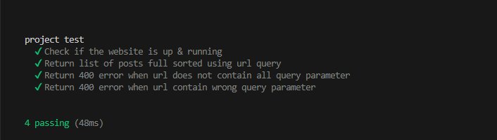

### Back end assesment example - blog post
Improving & skilling in back end development was never been working on multiple complex technologies at same time or building large API by your self
but by:
 - writing clean & correct code
 - code performance 
 - best practice
 - testing (Unit & E2E)
 - well organized
  
  so i diceded to build this small api, trying to achieve all the above.

#### how to run it
  after clone the repo run
#### install dependancies
  ``` npm install ```
#### running all tests 
  ``` npm run test ```
#### run the dev server
  ``` npm run dev ```
#### unit tests results
  


